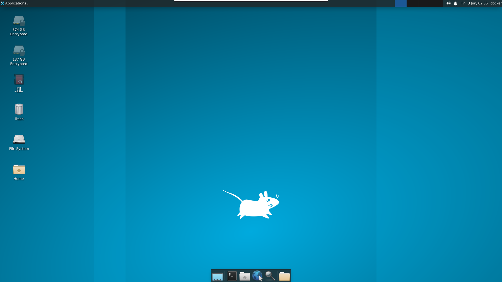

## 環境

- ubuntu:22.04
- xfce 4.16
  

## スクリーンショット

  

## 接続先

- port: 13389
- user: docker
- user-pass: docker
- root-pass: root
  

## 操作方法

### 起動
~~~bash
$ docker-compose up -d
~~~

`localhost:13389`にリモート接続
  

### 削除
~~~
$ docker-compose down --rmi all
~~~
  

### コンテナにbash接続
~~~
$ docker-compose exec docker_desktop bash
~~~
  

### ファイルの共有先
- host: files/
- container: ~/Public
  

## 作成環境

- ArchLinux
- docker 20.10.16
  

## 情報

タグより他のデスクトップ環境を選択可能